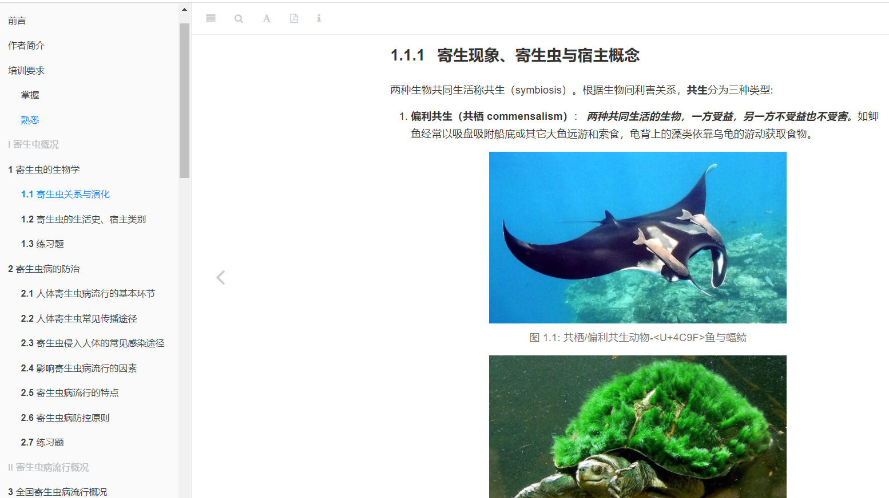

```{r,setup,include=FALSE}
##knitr设置
knitr::opts_chunk$set(
  fig.cap = TRUE,
  prompt = FALSE,
  comment = "",
  results = "asis",
  error = FALSE,
  message = FALSE,
  fig.align = "center",
  collapse = TRUE
  )
```

# 介绍

受邀参与重庆市公共卫生执业医师规范化培训工作，主要负责了寄生虫病概况和疟疾防控两个内容的讲解和培训。为此特编写了教材《重庆市公共卫生医师规范化培训-寄生虫病》。这本教材主要包括：

- 第 1 章主要介绍了寄生虫的生物学知识。
- 第 2 章主要介绍了寄生虫病的防治。
- 第 3章主要介绍全国主要寄生虫病流行概况。
- 第 4章主要介绍重庆市主要寄生虫病流行概况。
- 第 5章主要介绍疟疾的流行与防控概况。
- 第 6章主要介绍疟疾的基础知识。
- 第 7章主要介绍重庆市疟疾防控策略和措施。

点击图片阅读

<a href="https://bookdown.org/luofei/Parasitologybook/"></a>