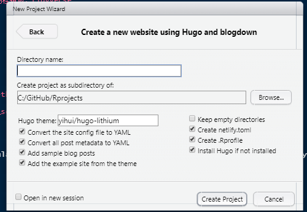

```{r,setup,include=FALSE}
##knitr设置
knitr::opts_chunk$set(
  fig.cap = TRUE,
  prompt = FALSE,
  comment = "",
  results = "asis",
  error = FALSE,
  message = FALSE,
  fig.align = "center",
  collapse = TRUE
  )

```

在繁忙的工作中，断断续续、跌跌撞撞地自学R语言，翻资料，查英文。这一段历程对于一个老大叔来说，作实有点辛苦，值得记录。还记得第一次正式接触和使用R还是2015年在上海工作期间。那时候也没有深入的了解和学习，只是基础的学习了平实在工作中可能会使用的基础功能。真正认真开始学习是2019年新冠疫情暴发之初，因为要处理大量数据、分析、绘图、建模，所以认真花费了一段时间来学习。在学习过程中参考了不少大牛的教材，书籍和参考资料等。尤其要感谢一辉。从使`rmarkdown`、`bookdown`、`blogdown`、`knit`，为了那个**文学编程**，害我还学习了`lantex`、`html`、`css`、`pandoc`登等，可谓是一把辛酸泪啊😭。关于这段历程，后面还是计划开个新章好好记录。这篇文章主要记录下，自己使用`blogdown`+ `hugo` + `netlify`, ~~踩坑心得~~ 建站历程。

## 关于blogdown

`blogdown`的具体功能我就累述了，希望多了解的请参考一辉大神的[blogdown](https://bookdown.org/yihui/blogdown/ "guild")，我这里只是记录自己的心得~~坑~~：

### 建立网站




```


