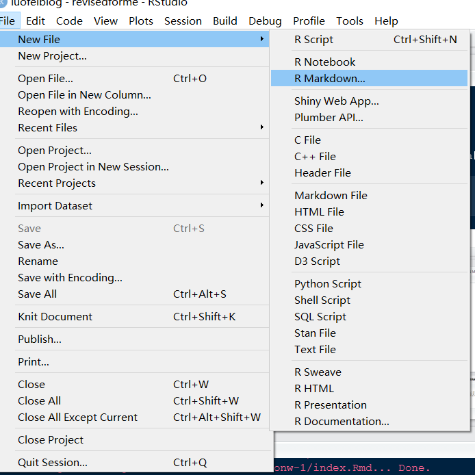
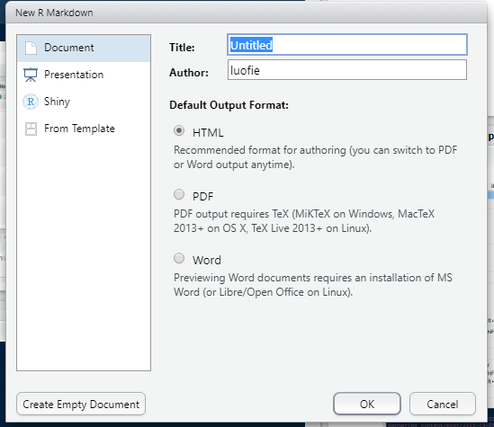

```{r,setup,include=FALSE}
library(tidyverse)
options(digits = 3)

##knitr设置
knitr::opts_chunk$set(
  prompt = FALSE,
  comment = "#",
  results = "markup",
  error = FALSE,
  message = FALSE,
  fig.align = "center",
  collapse = FALSE,
  tidy = TRUE
  )

```

对于一个公卫狗来说，很多工作都在分析数据、撰写报告总结的内容。这些文档有周报、月报、季报、年报。在使用R之前，经常会对同样架构的不同时间的的数据进行重复的分析和撰写。Rmarkdwon提供了非常便利的可重复复文档，简单来说就是根据跟新的数据库一键生成同样格式的文档。文档的类型可以是PDF和WORD。非常的便利。

# Rmarkdown基础

## markdown
Markdown是一种轻量级标记语言，排版语法简洁，让人们更多地关注内容本身而非排版。它使用易读易写的纯文本格式编写文档，可与HTML混编，可导出HTML、PDF以及本身的`.md`格式的文件。因简洁、高效、易读、易写，Markdown被大量使用，如Github、Wikipedia、简书等。

Markdown已经是一种轻量化的语言，他的不足在于当需要转换为PDF或者WORD格式时有点力不从心了。针对这问题，目前供职与Rstudio的谢益辉大神在Markdown的基础上开发了rmarkdwon包。Rmarkdown的优点有：

- 具备markdown简单的文本标记语言；

- 相较于markdown有更丰富的文档排版能力；

- 可以在生成文档时直接运行插入的代码块，并将运行结果输出在最终文档中。


## 基本语法

Rmarkdown的基本语法与markdwon相同，几乎所有markdown能用的语法都可以在其中使用。

常用的markdown语法见表\@ref(tab:table001)，更详细的语法请参考[Markdown官方教程](https://markdown.com.cn/basic-syntax/)

Table:(\#tab:table001)Rmarkdown的优点

输入  | 结果 
:-----|:------:
普通文本          |   普通文本 
\*斜体文本\*        |   *斜体文本* 
\*\*加粗文本\*\*      |   **加粗文本**  
\*\*\*斜体加粗文本\*\*\*|  ***斜体加粗文本***  
\~\~删除线文本\~\~    |   ~~删除线文本~~ 
上标\^文本\^       |   上标^文本^
\`代码文本\`       | `代码文本`
\# 一级标题  | 

## 建立Rmarkdwon文件

在RStudio选择`文件-新建-Rmarkdown`就可以建立一个最简单的rmarkdown的模板。（图 \@ref(fig:fig001)）

```{r ,fig001, fig.cap="新建rmarkdown文件"}

```

新建文件后会弹出新的窗口，如图\@ref(fig:fig002)所示。窗口中可以设置标题、作者和输出文件类型。在左边栏选择"From Template"会有更多的模板更选择。你也可以安装相应的R包扩展更多的模板。

```{r, fig002, fig.cap="新建文件窗口"}

```

# WORD格式文件输出

# PDF格式文件输出

